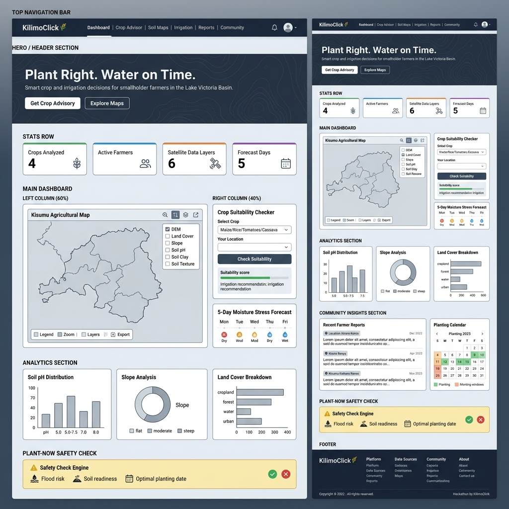

# 🌾 KilimoClick — UI Design Brief & Prompt

> **For the UI Designer/Developer**
> This document contains everything you need to build the KilimoClick interface — the wireframe reference, full UI prompt, design tokens, and component specifications.

---

## 📁 Wireframe Reference

The annotated wireframe for this platform is located at:

```
design/wireframes/kilimo_click_wireframe.png
```



> The wireframe shows both a **zoomed-out full page view** (left) and a **zoomed-in detailed view** (right) of every section. Use both to understand layout proportions and component details.

---

## 🎨 UI Design Prompt

> Copy and use this prompt with any AI design tool (v0.dev, Lovable, Figma AI, Galileo, etc.) or hand it directly to your UI developer.

---

### ✏️ FULL PROMPT

```
Design a full-stack agricultural decision-support web dashboard called "KilimoClick" 
for smallholder farmers and community planners in the Lake Victoria Basin, Kisumu, Kenya.

---

🎯 PURPOSE
KilimoClick turns complex satellite and soil datasets into simple, actionable farming 
decisions. It answers three core questions for every farmer:
  1. What crop should I plant here?
  2. Is it safe to plant right now?
  3. How should I irrigate?

---

🎨 DESIGN AESTHETIC
- Style: Data-rich, modern civic tech dashboard — think NASA Worldview meets GOV.UK 
  meets Notion, but warmer and community-forward.
- Mood: Trustworthy, earthy, precise, empowering.
- Primary Color: Deep forest green — #1B5E20 or HSL(123, 56%, 24%)
- Accent Color: Warm amber — #F59E0B (for safety alerts, highlights)
- Background: Dark mode — #0D1B2A (deep navy-black) 
- Surface cards: #132035 with subtle border rgba(255,255,255,0.07)
- Text: #E8EDF3 (primary), #8FA3B1 (secondary/muted)
- Charts: Use a palette of [#4ADE80, #60A5FA, #F59E0B, #F87171, #A78BFA]
- Font: "Inter" for UI text, "Space Grotesk" for headings (Google Fonts)
- Radius: 12px for cards, 8px for inputs/buttons
- Shadows: Soft glow shadows (e.g., box-shadow: 0 4px 24px rgba(0,0,0,0.4))
- Micro-animations: Fade-ins on load, smooth hover transitions (200ms ease),
  map layer toggle transitions, chart bar grow-in animations.
- Icons: Use Lucide Icons or Phosphor Icons throughout.

---

📐 PAGE LAYOUT & SECTIONS

Build the following sections in order, top to bottom:

### 1. TOP NAVIGATION BAR (sticky, full-width)
- Left: Logo — a stylized wheat stalk SVG + wordmark "KilimoClick" in Space Grotesk
- Center: Navigation links — Dashboard | Crop Advisor | Soil Maps | Irrigation | 
  Reports | Community
- Right: Notification bell (with badge), user avatar with dropdown
- Background: #0D1B2A with a 1px bottom border rgba(255,255,255,0.08)
- Active nav link: Green underline indicator + slightly brighter text

### 2. HERO BANNER (full-width, 320px tall)
- Headline (h1): "Plant Right. Water on Time."
  — Font: Space Grotesk, 56px, bold, white
- Subtitle: "Smart crop and irrigation decisions for smallholder farmers 
  in the Lake Victoria Basin."
  — Font: Inter, 18px, #8FA3B1
- Two CTA buttons:
  - Primary: "Get Crop Advisory" — filled green button (#1B5E20 bg, white text)
  - Secondary: "Explore Maps" — outlined, white border, transparent bg
- Background: Dark navy with a subtle animated SVG contour map overlay 
  (very low opacity ~5%), showing topographic lines of Kisumu region.
- Optional: A small "Powered by KijaniSpace Satellite Data" badge bottom-right.

### 3. KPI STATS ROW (4 cards, equal width grid)
Display four key metrics in a horizontal row of cards:
- Card 1 | Icon: Sprout | Label: "Crops Analyzed" | Value: "4"
  Border-top color: #4ADE80
- Card 2 | Icon: Users | Label: "Active Farmers" | Value: "1,240+"
  Border-top color: #60A5FA  
- Card 3 | Icon: Satellite | Label: "Satellite Layers" | Value: "6"
  Border-top color: #F59E0B
- Card 4 | Icon: CloudRain | Label: "Forecast Horizon" | Value: "5 Days"
  Border-top color: #A78BFA
Each card: dark surface bg, 4px colored top border, icon (32px), large value 
text (40px bold), smaller label below, subtle hover lift animation.

### 4. MAIN DASHBOARD (two-column layout, 60/40 split)

#### LEFT PANEL — "Kisumu Agricultural Map" (60%)
- Full-height interactive map panel with dark map basemap.
- Map displays the Kisumu region boundary with data layer overlays.
- Floating layer toggle panel (top-right of map):
  Toggleable checkboxes/switches for each layer:
  ☑ Digital Elevation Model (DEM)
  ☑ Land Cover (ESA WorldCover)
  ☐ Slope Analysis
  ☐ Soil pH
  ☐ Soil Clay Content
  ☐ Soil Texture
  Each layer has a small color swatch and a visibility toggle.
- Bottom toolbar: Legend | Zoom In | Zoom Out | Reset View | Export PNG
- Active layer shown with a subtle color legend bar at the bottom-left.
- Map should feel like a GIS tool — dark basemap (Mapbox Dark or CartoDB Dark Matter).

#### RIGHT PANEL (40%) — Two stacked cards:

**Card A — Crop Suitability Checker**
Title: "🌱 Crop Suitability Checker"
Form fields:
  - Dropdown: "Select Crop" → options: Maize | Rice | Tomatoes | Cassava
  - Dropdown: "Your Sub-location" → (list of Kisumu sub-locations)
  - Button: "Check Suitability" (full-width, green)
Result area (shown after submit):
  - Suitability score: Labeled progress bar 0–100% in green
  - pH Range: e.g., "5.5 – 7.0 ✓"
  - Max Slope: e.g., "10° ✓"
  - Water Need: "Medium 💧"
  - Irrigation Method: Bold badge — e.g., "Rainfed" or "Drip" or "Sprinkler"
  - Alert banner if conditions are not met (amber warning).

**Card B — 5-Day Moisture Stress Forecast**
Title: "🌦️ 5-Day Moisture Stress Forecast"
Display 5 day columns (Mon–Fri), each showing:
  - Day label
  - Weather icon (sun/cloud/rain)
  - Moisture stress level: colored dot (🟢 Low | 🟡 Moderate | 🔴 High)
  - Moisture % value
Bottom note: "Data from KijaniSpace live climate stream"

### 5. ANALYTICS SECTION (3 equal-width chart cards)

**Chart 1 — Soil pH Distribution**
- Bar chart showing pH value distribution across Kisumu farmland
- X-axis: pH ranges (4.5–5.0, 5.0–5.5, 5.5–6.0, 6.0–6.5, 6.5–7.0, 7.0+)
- Y-axis: % of farmland area
- Bar color: gradient green to amber based on optimal range
- Annotation: vertical dashed line at "Optimal Range" zone

**Chart 2 — Slope Category Breakdown**
- Donut chart with 3 segments:
  - Flat (0–5°): #4ADE80
  - Moderate (5–15°): #F59E0B  
  - Steep (15°+): #F87171
- Center label: "Slope" with dominant category below
- Legend below chart

**Chart 3 — Land Cover Breakdown**
- Horizontal stacked bar chart
- Categories: Cropland | Forest | Water Bodies | Urban | Grassland | Bare Land
- Use earthy color palette
- Percentage labels on each bar segment

### 6. COMMUNITY INSIGHTS (two-column)

**Left — Recent Farmer Reports**
- Title: "📋 Recent Farmer Reports"
- List of 3–4 cards, each showing:
  - Location badge (e.g., "📍 Ahono Konos")
  - Date chip
  - Short 2-line report text
  - Crop tag (e.g., #Maize)
- "View All Reports →" link at bottom

**Right — Planting Calendar**
- Title: "📅 Planting Calendar — 2025"
- Mini monthly calendar grid
- Color-coded cells:
  - 🟢 Green: Optimal planting window
  - 🟡 Amber: Marginal (plant with caution)
  - ⬜ Grey: Not recommended
- Legend: Optimal | Marginal | Avoid
- Month navigation arrows

### 7. PLANT-NOW SAFETY CHECK (full-width alert banner)
- Background: Amber/dark amber (#1C1500 with amber border)
- Title: "⚡ Plant-Now Safety Check Engine"
- Subtitle: "Deterministic rule checks to protect your seeds and investment."
- Three status checks displayed horizontally as icon + label + status badge:
  - 🌊 Flood Risk: "LOW" badge (green)
  - 🌱 Soil Readiness: "READY" badge (green)
  - 📅 Optimal Planting Date: "CONFIRMED" badge (green)
- If any check fails: Show red "HOLD — Do Not Plant" badge + reason text
- "Run New Check" button on the right

### 8. DATA SOURCES STRIP (full-width, compact)
- Dark strip showing data provenance icons and labels:
  ESA WorldCover | SoilGrids | SRTM DEM | KijaniSpace Satellite | 
  OpenStreetMap | CHIRPS Rainfall
- Each shown as a small logo + label in a pill/tag style

### 9. FOOTER (full-width, dark)
- Logo + tagline: "KilimoClick — Plant Right. Water on Time."
- 4 link columns: Platform | Data Sources | Community | About
- Bottom bar: "© 2025 KilimoClick. Built at KijaniSpace Talent Hackathon — 
  Challenge 6, LakeHub Kisumu"
- Social icons: GitHub | Twitter/X | LinkedIn

---

🧩 COMPONENT SPECIFICATIONS

Buttons:
- Primary: bg #1B5E20, text white, hover: bg #2E7D32, border-radius 8px
- Secondary: border 1.5px white, transparent bg, hover: bg rgba(255,255,255,0.05)
- Danger: bg #7F1D1D, text white

Form Inputs:
- Background: rgba(255,255,255,0.05)
- Border: 1px solid rgba(255,255,255,0.12)
- Focus: border-color #4ADE80, glow ring rgba(74,222,128,0.2)
- Border-radius: 8px

Cards:
- Background: #132035
- Border: 1px solid rgba(255,255,255,0.07)
- Border-radius: 12px
- Padding: 24px
- Hover: translateY(-2px) transition, slight border brightening

Map Panel:
- Basemap: CartoDB Dark Matter or Mapbox Dark
- Active layer overlays should have adjustable opacity
- Use Leaflet.js or Mapbox GL JS for implementation

Charts:
- Use Chart.js or Recharts
- All charts have dark transparent backgrounds
- Grid lines: rgba(255,255,255,0.06)
- Tooltip: dark card style with white text

---

📱 RESPONSIVE REQUIREMENTS
- Desktop (1280px+): Full 2-column dashboard, all sections visible
- Tablet (768px–1279px): Stack map and right panel vertically; 2-col analytics
- Mobile (< 768px): Single column; collapsible nav; map becomes a 250px preview 
  with "Open Full Map" button; charts scroll horizontally

---

🔌 DATA INTEGRATION NOTES (for developer)
The following data files are available in the repository:
- `Crop_Logic_Matrix.json` → Powers the Crop Suitability Checker logic
- `Kisumu_DEM_4326.tif` → Elevation layer for the map
- `Kisumu_LandCover.tif` → Land cover layer
- `Kisumu_Slope_4326.tif` → Slope analysis layer
- `Kisumu_Soil_pH_4326.tif` → Soil pH layer
- `Kisumu_Soil_Clay_4326.tif` → Soil clay content layer
- `Kisumu_Soil_Texture_4326.tif` → Soil texture layer

Use GeoTIFF.js or a tile server (e.g., TiTiler / GDAL2Tiles) to render .tif 
layers on the map. All rasters are in EPSG:4326 projection.

---

🚀 TECH STACK SUGGESTION
- Framework: Next.js 14 (App Router) or plain Vite + React
- Map: Leaflet.js with Leaflet.GeoTIFF plugin OR Mapbox GL JS
- Charts: Recharts or Chart.js
- Styling: Tailwind CSS (dark mode) or Vanilla CSS with CSS variables
- Icons: Lucide React
- Fonts: Google Fonts — Inter + Space Grotesk
- Deployment: Vercel or Netlify

```

---

## 📂 Folder Structure

```
Skyscorp/
├── design/
│   ├── UI_PROMPT.md              ← This file (design brief + full UI prompt)
│   └── wireframes/
│       └── kilimo_click_wireframe.png   ← Annotated wireframe (full page)
├── Crop_Logic_Matrix.json        ← Crop rules data
├── Kisumu_DEM_4326.tif           ← Elevation raster
├── Kisumu_LandCover.tif          ← Land cover raster
├── Kisumu_Slope_4326.tif         ← Slope raster
├── Kisumu_Soil_Clay_4326.tif     ← Soil clay raster
├── Kisumu_Soil_Texture_4326.tif  ← Soil texture raster
├── Kisumu_Soil_pH_4326.tif       ← Soil pH raster
└── README.md
```

---

## ✅ Handoff Checklist for UI Team

- [ ] Review wireframe in `design/wireframes/kilimo_click_wireframe.png`
- [ ] Copy the full prompt above into your preferred AI design tool (v0.dev, Lovable, Figma AI, etc.)
- [ ] Set up the project with the recommended tech stack
- [ ] Integrate `Crop_Logic_Matrix.json` for the Crop Suitability Checker
- [ ] Use Leaflet.js + GeoTIFF plugin for map layers
- [ ] Test on Desktop, Tablet, and Mobile
- [ ] Push your work to the `ui/` branch and open a PR

---

## 🤝 Questions?

Open an issue on this repo or reach out to the team lead.

> *Built for Challenge 6 — KijaniSpace Talent Hackathon, LakeHub Kisumu* 🌍
